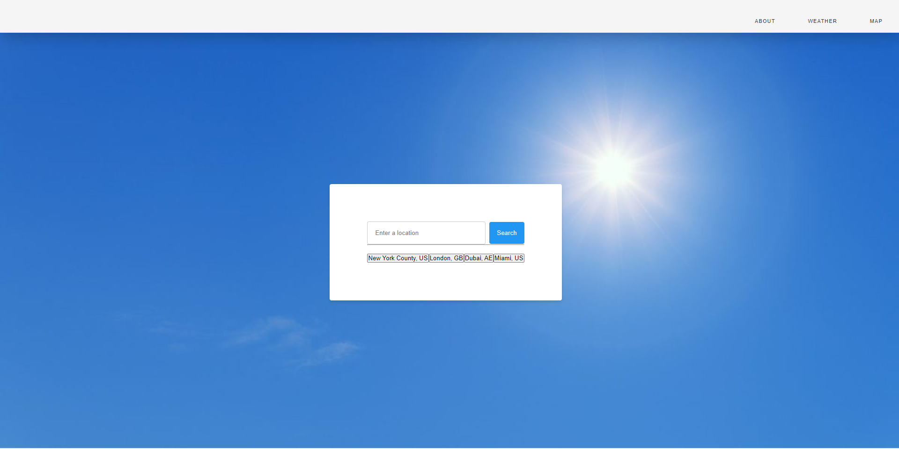
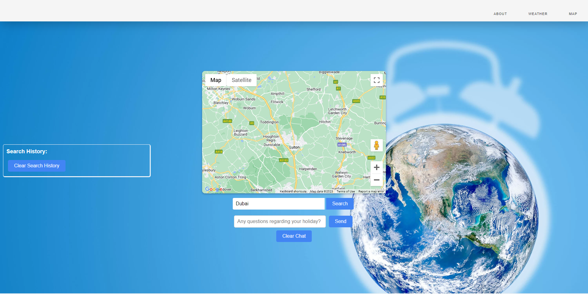

# Holiday Explorer

# Description:
Holiday Explorer is a web application that helps users discover and explore various holiday destinations around the world. It provides users with information about popular tourist spots, attractions, activities, and local recommendations for different destinations. Users can search for specific locations or browse through curated lists of destinations based on different themes, such as beach getaways, historical sites, or adventure trips. The application utilizes HTML5, CSS, JavaScript (including libraries like jQuery), and server-side APIs such as the Google Maps API and OpenWeatherMap API.

The Weather App is another project that aims to provide users with real-time weather information. It displays essential weather data like temperature, humidity, wind speed, and other relevant details. The app features visual representations of weather conditions, hourly forecasts, location search functionality, the ability to save and manage multiple locations, integration with Google Maps, and a 5-day forecast and a automatic text box with answers for the location searched.. As a stretch goal, the app may also include additional weather-related information like UV index, air quality index, pollen count, or sunrise/sunset times.

# Holiday Explorer Features:

1. Search: Users can search for specific holiday destinations..
2. Interactive Map: Integrates the Google Maps API to display an interactive map of each destination.
3. Weather Information: Utilizes the OpenWeatherMap API to provide real-time weather data for each destination.
4. Automatic AI chat box: Utilizes ChatGPT API to provide real time answers for the questions provided by the users , related to their destinations.
5. User Reviews and Ratings: Users can leave reviews and ratings in the homepage to rate the service.
6. Persistent User Preferences: Client-side storage (localStorage) stores user preferences like favorite destinations or saved itineraries.
7. Responsive Design: The user interface is designed to be responsive for optimal viewing on different devices.
8. Polished UI: Attention to detail in terms of layout, typography, colors, and overall aesthetics.

# Weather and Map Page Acceptance Criteria:

Supports location search functionality to retrieve weather details for specific cities.
Displays current temperature, humidity, wind speed, and other relevant weather data.
Visual representation of weather conditions, such as icons or animations.
Option to view an hourly forecast to plan the day effectively.
Ability to save and manage multiple locations for easy access to weather information.
Integration with Google Maps to view weather forecasts directly on the map interface.
Provides a 5-day forecast for planning upcoming days.
Search for a location to view a real map from the location searched.
Ability to choose between map and satellite view of the searched location.
Option to use the map character to see the roads in a first person view.
Integration of a automatic AI chat box to ask questions related to the selected location.
Ability to obtain answers real time answers related to the search from the automatic chat box.
User-friendly interface with intuitive navigation and visually appealing design.
Stretch Goal: Additional weather-related information like UV index, air quality index, pollen count, or sunrise/sunset times.
Please note that these two projects, Map (with chat) and the Weather App, have distinct functionalities and features. Map Page focuses on exploring holiday destinations and providing local recommendations, while the Weather App focuses on delivering real-time weather information and forecasts.

# Usage

To use this website is pretty simple. You have the homepage that contains the ratings and a contact form that can be used to give any tips or ask any questions related to the page, then on top of the page it should be 3 options , Home , Weather , and Maps , the Weather one should transfer you to a page with a text box saying (Enter a location) and a button saying (Search), you type a city from anywhere in the world and click search and you should be prompted with a weather for that city in the current moment and a 5 day weather forecast that should be displaying the weather for the next 5 days. If you decide to go to the map page , you should be able to see a text box saying (Search) and a button saying the same. You type a location there and you should be moved to the location you choose. On the left side there will be a Search history that you can clear by clicking on the button that says (Clear Search History). Bellow the Searcg Text Box you should be able to see a Text box saying (Any questions regarding your holiday?) with a button saying send next to it. YOu type a question related to the location your searched like the best activities or the best places to vitisit and you should be prompted with an answer from the automatic AI system that should contain information related to your answer that should help you with. If you prefer to cler the chat you can just click on the button bellow and it should clear the chat for you.

**GitHub Repository:** [https://github.com/daleyjones/project-1.git]

**Deployed Application:** [https://daleyjones.github.io/project-1/]
