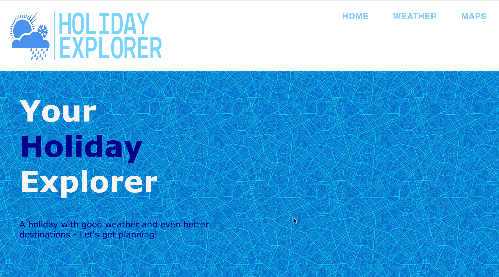

# Holiday Explorer

# Description:
Holiday Explorer is a web application that helps users discover and explore various holiday destinations around the world. It provides users with information about popular tourist spots, attractions, activities, and local recommendations for different destinations. Users can search for specific locations or browse through curated lists of destinations based on different themes, such as beach getaways, historical sites, or adventure trips. The application utilizes HTML5, CSS, JavaScript (including libraries like jQuery), and server-side APIs such as the Google Maps API and OpenWeatherMap API.

The Weather App is another project that aims to provide users with real-time weather information. It displays essential weather data like temperature, humidity, wind speed, and other relevant details. The app features visual representations of weather conditions, hourly forecasts, location search functionality, the ability to save and manage multiple locations, integration with Google Maps, weather alerts/notifications, and a 5-day forecast. As a stretch goal, the app may also include additional weather-related information like UV index, air quality index, pollen count, or sunrise/sunset times.

# Holiday Explorer Features:

1. Search: Users can search for specific holiday destinations or browse through predefined categories.
Destination Details: Each destination has a dedicated page with a brief description, popular attractions, recommended activities, and local weather.
2. Interactive Map: Integrates the Google Maps API to display an interactive map of each destination.
Weather Information: Utilizes the OpenWeatherMap API to provide real-time weather data for each destination.
User Reviews and Ratings: Users can leave reviews and ratings for the destinations they have visited.
3. Persistent User Preferences: Client-side storage (localStorage) stores user preferences like favorite destinations or saved itineraries.
4. Responsive Design: The user interface is designed to be responsive for optimal viewing on different devices.
5. Polished UI: Attention to detail in terms of layout, typography, colors, and overall aesthetics.
# Weather App Acceptance Criteria:

Provides real-time weather information based on the user's current location.
Displays current temperature, humidity, wind speed, and other relevant weather data.
Visual representation of weather conditions, such as icons or animations.
Option to view an hourly forecast to plan the day effectively.
Supports location search functionality to retrieve weather details for specific cities.
Ability to save and manage multiple locations for easy access to weather information.
Integration with Google Maps to view weather forecasts directly on the map interface.
Weather alerts or notifications for severe weather conditions in selected locations.
Provides a 5-day forecast for planning upcoming days.
User-friendly interface with intuitive navigation and visually appealing design.
Stretch Goal: Additional weather-related information like UV index, air quality index, pollen count, or sunrise/sunset times.
Please note that these two projects, Holiday Explorer and the Weather App, have distinct functionalities and features. Holiday Explorer focuses on exploring holiday destinations and providing local recommendations, while the Weather App focuses on delivering real-time weather information and forecasts.

# Screenshot

**GitHub Repository:** [https://github.com/daleyjones/project-1.git]

**Deployed Application:** [https://daleyjones.github.io/project-1/]
